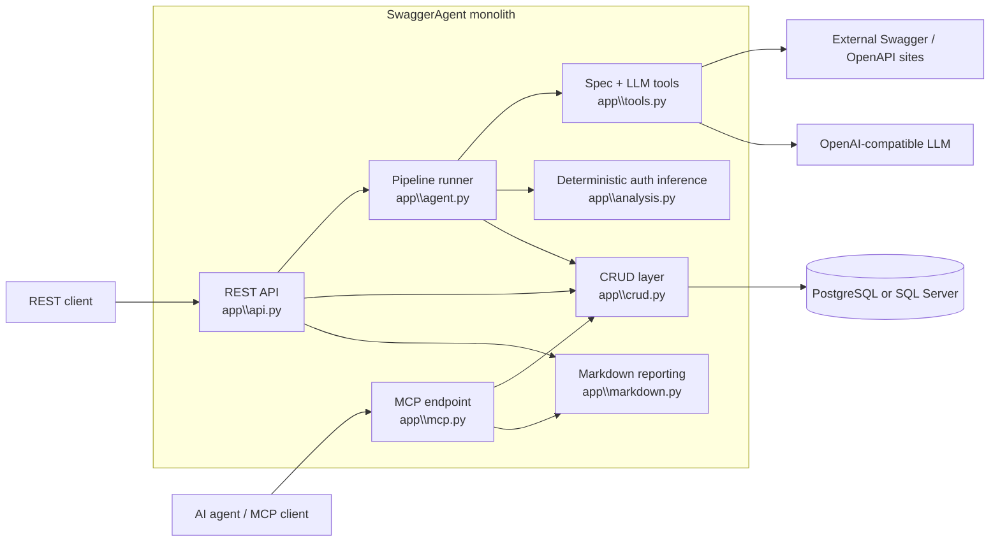
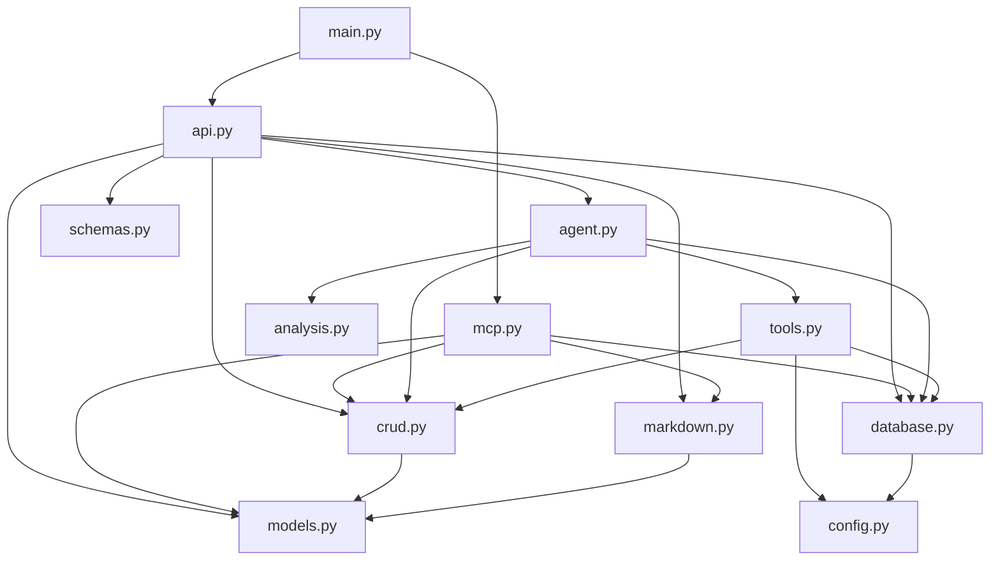
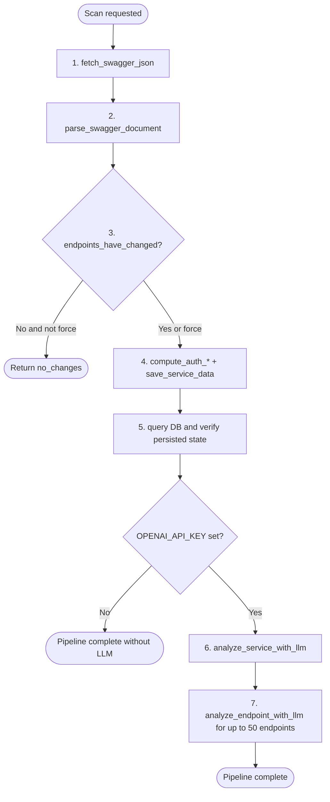
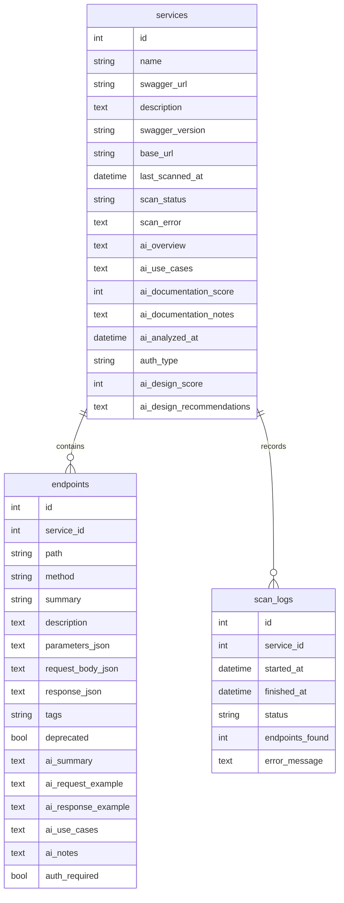
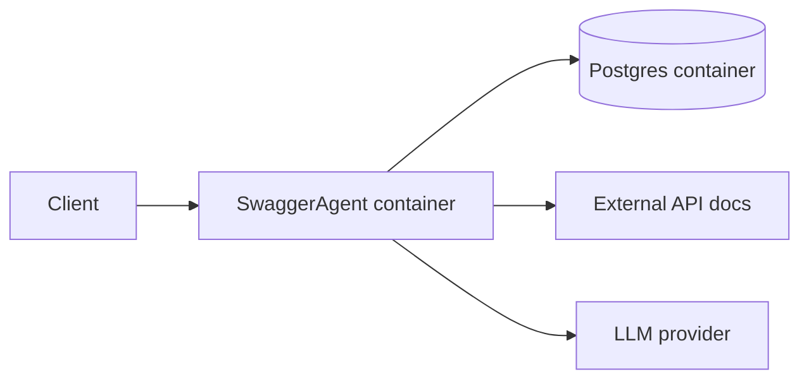

# Project Architecture Blueprint

**Generated:** 2026-04-17T19:48:38Z  
**Repository:** `ltomcza/SwaggerAgent`  
**Primary stack:** Python 3.12, FastAPI, SQLAlchemy 2.x, Alembic, Pydantic, LangChain, Requests  
**Primary architectural pattern:** Layered monolith with a pipeline-oriented application core

## 1. Executive summary

SwaggerAgent is a **single FastAPI application** that manages a catalog of external Swagger/OpenAPI services, periodically fetches their specifications, normalizes them into a common internal shape, persists them into a relational database, and optionally enriches them with LLM-generated analysis. The codebase is organized as a **layered monolith** rather than microservices: the HTTP API, pipeline orchestration, deterministic analysis, persistence, reporting, and MCP integration all live in one deployable unit.

The most important architectural shape is the **7-step scan pipeline** in `app\agent.py`. It acts as the application workflow boundary: fetch a spec, parse it, detect changes, enrich it, save it, verify persistence, then optionally run service-level and endpoint-level LLM analysis. This creates a clear separation between **deterministic ingestion logic** and **optional AI enrichment**.

The codebase also uses a pragmatic split between **framework-edge dependency injection** and **direct application-level session management**. FastAPI endpoints depend on `get_db()` from `app\database.py`, while background jobs and tool functions instantiate `SessionLocal()` directly. That split is intentional in the current design and is a key constraint when extending the system.

## 2. Architecture detection

### 2.1 Technology profile

| Area | Technology | Evidence |
|---|---|---|
| Web framework | FastAPI | `app\main.py`, `app\api.py`, `app\mcp.py` |
| ORM / data access | SQLAlchemy ORM 2.x | `app\models.py`, `app\crud.py`, `app\database.py` |
| Schema migration | Alembic | `alembic\env.py`, `alembic\versions\001_initial_schema.py` |
| Configuration | Pydantic Settings | `app\config.py` |
| External HTTP | Requests | `app\tools.py` |
| AI integration | LangChain structured output | `app\tools.py` |
| Reporting | Markdown generation | `app\markdown.py` |
| Agent integration | MCP / JSON-RPC 2.0 | `app\mcp.py` |
| Runtime packaging | Docker / Docker Compose | `Dockerfile`, `docker-compose.yml`, `docker-compose.debug.yml` |
| Tests | Pytest | `pyproject.toml`, `tests\*.py` |

### 2.2 Architectural pattern

SwaggerAgent is best described as a **layered monolith with a pipeline application core**:

1. **Interface layer**: REST and MCP endpoints in `app\api.py` and `app\mcp.py`
2. **Application orchestration layer**: the 7-step runner in `app\agent.py`
3. **Domain/analysis layer**: auth inference and spec parsing logic in `app\analysis.py` and `app\tools.py`
4. **Persistence layer**: ORM models and CRUD functions in `app\models.py` and `app\crud.py`
5. **Presentation/reporting layer**: markdown rendering in `app\markdown.py`
6. **Infrastructure/configuration layer**: database/config/bootstrap in `app\config.py`, `app\database.py`, `alembic\*`, Docker files

This is **not** clean architecture in the strict sense because the application layer imports concrete persistence and infrastructure modules directly. It is also **not** event-driven or microservice-based. The design is intentionally direct, synchronous, and repository-local.

## 3. Architectural overview

### 3.1 System context



### 3.2 Guiding principles visible in the code

- **Keep fetch/parse/save deterministic** before invoking the LLM.
- **Persist normalized data first**, enrich later.
- **Use simple synchronous control flow** over queues or workers.
- **Prefer explicit module responsibilities** over shared utility layers.
- **Return user-facing HTTP errors at the API edge**, but use log-and-string patterns inside tooling/pipeline functions.
- **Preserve portability** between PostgreSQL and SQL Server at the configuration level.

## 4. Component map

### 4.1 Major components

| Component | Responsibility | Key files | Notes |
|---|---|---|---|
| HTTP API | CRUD for services, triggering scans/analysis, returning reports | `app\api.py` | Uses FastAPI routing and `Depends(get_db)` |
| MCP interface | JSON-RPC 2.0 endpoint exposing agent-facing tools | `app\mcp.py` | Separate protocol surface over same data model |
| Pipeline runner | Orchestrates the end-to-end scan workflow | `app\agent.py` | Central application workflow boundary |
| Spec ingestion tools | Fetch, parse, save, LLM analyze, service info | `app\tools.py` | Mix of deterministic and AI-backed functions |
| Deterministic analysis | Auth type and auth-required inference | `app\analysis.py` | Pure functions with heuristic rules |
| Persistence | ORM models and CRUD operations | `app\models.py`, `app\crud.py` | Relationship/cascade rules live here |
| Reporting | Single-service and multi-service markdown rendering | `app\markdown.py` | Presentation layer over persisted data |
| Configuration/bootstrap | App startup, logging, DB settings, migrations | `app\main.py`, `app\config.py`, `app\database.py`, `alembic\*` | Infrastructure layer |

### 4.2 Internal dependency direction



Observed dependency flow stays mostly one-way from entrypoints toward persistence/infrastructure. No clear circular import problems are visible in the current module layout.

## 5. Core workflow: the 7-step pipeline

The most important runtime behavior is `run_swagger_analysis()` in `app\agent.py`.



### 5.1 Workflow behavior

- **Step 1** tries multiple candidate URLs, supports JSON and YAML, can mine HTML documentation pages for embedded or linked specs, and can follow `Link` headers and Spring `swagger-resources`.
- **Step 2** normalizes OpenAPI 3.x and Swagger 2.0 into a common dict with `title`, `description`, `version`, `base_url`, `security_schemes`, and `endpoints`.
- **Step 3** prevents unnecessary downstream work via endpoint fingerprint comparison.
- **Step 4** enriches endpoints with auth inference and persists the entire service snapshot.
- **Step 5** verifies persistence by reading back the service and endpoints.
- **Step 6** performs service-level analysis and endpoint summary enrichment.
- **Step 7** only runs for endpoints missing request/response examples and is capped to control cost.

### 5.2 Architectural significance

This pipeline creates a strong **deterministic-before-LLM** boundary. New features should preserve that property unless there is a deliberate reason to move AI earlier in the flow.

## 6. Layer responsibilities and dependency rules

### 6.1 Interface layer

**Files:** `app\api.py`, `app\mcp.py`

Responsibilities:
- Receive HTTP or JSON-RPC requests
- Validate request shape via FastAPI/Pydantic
- Translate missing-resource cases into protocol-specific errors
- Trigger application workflows or reporting

Rules:
- May depend on `crud`, `markdown`, `schemas`, `database`, and application workflows
- Should not implement parsing or domain heuristics inline
- Should keep protocol logic localized to the entrypoint module

### 6.2 Application orchestration layer

**File:** `app\agent.py`

Responsibilities:
- Sequence business steps
- Decide whether to skip work (`no_changes`)
- Bound cost-heavy deep analysis
- Produce a single status summary string

Rules:
- May coordinate `tools`, `crud`, `analysis`, and database access
- Should not define HTTP routes or response schemas
- Should remain the only place that owns the end-to-end scan workflow order

### 6.3 Domain/analysis layer

**Files:** `app\analysis.py`, parsing/fetch portions of `app\tools.py`

Responsibilities:
- Normalize heterogeneous Swagger/OpenAPI inputs
- Infer auth type and endpoint auth requirements
- Resolve `$ref` structures and derive canonical endpoint payloads

Rules:
- Prefer pure functions where practical
- Keep outputs serialization-friendly because they are persisted as JSON strings

### 6.4 Persistence layer

**Files:** `app\models.py`, `app\crud.py`, `app\database.py`

Responsibilities:
- Define persistent entities and relationships
- Encapsulate database mutation/query patterns
- Preserve cascade-delete and snapshot-replacement behavior

Rules:
- API and MCP layers should use CRUD helpers rather than ad hoc ORM logic unless eager loading or protocol-specific shaping is needed
- New persistent fields should be wired through models, migration, CRUD, and response schemas together

### 6.5 Presentation/reporting layer

**File:** `app\markdown.py`

Responsibilities:
- Convert ORM-backed data into human-readable markdown
- Filter and pretty-print JSON content
- Present AI and non-AI fields consistently

Rules:
- Keep rendering logic out of API and MCP handlers
- Do not mutate database state from reporting code

## 7. Data architecture

### 7.1 Domain model



### 7.2 Persistence patterns

- **Service** is the aggregate root.
- **Endpoint** records are treated as a **replaceable snapshot** of the current spec, not as individually versioned resources.
- **ScanLog** captures operational history for scans, including `no_changes` outcomes.
- AI fields are stored directly on `Service` and `Endpoint` rather than split into separate analysis tables.

### 7.3 Data access patterns

| Pattern | Implementation |
|---|---|
| Repository-style module | `app\crud.py` centralizes DB operations |
| Session management | `get_db()` in API edge, `SessionLocal()` directly in background/tool code |
| Snapshot refresh | `replace_endpoints()` deletes old rows then inserts new rows |
| Diffing | `endpoints_have_changed()` compares endpoint fingerprints |
| Eager loading | `selectinload(Service.endpoints)` in read-heavy API/MCP paths |

### 7.4 Data transformation

- Raw OpenAPI/Swagger docs are transformed into a **normalized dict** before persistence.
- Endpoint structures are serialized into text columns as JSON strings for parameters, request bodies, responses, and tags.
- Markdown rendering rehydrates those fields for display.

## 8. Cross-cutting concerns

### 8.1 Authentication and authorization

SwaggerAgent itself does **not** implement user authentication for its own API. Its auth logic is about **inferring the auth model of external APIs** being analyzed.

Implementation pattern:
- `compute_auth_type()` maps security schemes into canonical labels like `apiKey`, `http/bearer`, `oauth2`, or `mixed`.
- `compute_auth_required()` combines explicit security declarations with heuristics based on paths, parameters, and methods.
- Results are stored as `Service.auth_type` and `Endpoint.auth_required`.

### 8.2 Error handling and resilience

The codebase uses two distinct error strategies:

| Layer | Pattern |
|---|---|
| API/MCP edge | Raise protocol-native errors (`HTTPException`, JSON-RPC error objects) |
| Pipeline/tool layer | Catch exceptions, log them, and return descriptive strings |

Consequences:
- The scan pipeline is resilient to partial AI failures because deterministic save steps happen first.
- Tool functions are easy to compose in the runner because they return status strings.
- The tradeoff is weaker type guarantees for internal control flow.

### 8.3 Logging and observability

- Logging is configured centrally in `app\main.py` via `logging.basicConfig`.
- Both `StreamHandler` and `FileHandler` write to `logs\swagger_agent.log`.
- Modules consistently use `logging.getLogger(__name__)`.
- Background operations log lifecycle events and failures with service IDs.

### 8.4 Validation

Validation is distributed across layers:

- **Request validation**: FastAPI + Pydantic models in `app\schemas.py`
- **Spec validation**: `fetch_swagger_json()` and `_is_swagger_dict()` verify the response looks like an API description
- **Heuristic validation**: parsing and auth inference functions handle malformed or partial source data defensively
- **Test validation**: pytest modules assert rendering, API, CRUD, pipeline, MCP, and analysis behavior

Notable design choice: `swagger_url` is intentionally a plain `str` in `ServiceCreate` rather than a stricter URL type.

### 8.5 Configuration management

- Settings are centralized in `app\config.py` using `BaseSettings`
- `.env` is the primary local source
- `DB_TYPE` selects PostgreSQL vs SQL Server connection-string generation
- `OPENAI_API_KEY` acts as a feature gate for AI enrichment
- Docker Compose injects environment from `.env` plus explicit DB defaults

## 9. Service communication patterns

### 9.1 Internal communication

- Mostly **in-process synchronous function calls**
- No event bus
- No message queue
- No background worker service outside FastAPI request handling

### 9.2 External communication

| Interaction | Protocol | Code |
|---|---|---|
| Fetch external specs | HTTP(S) with `requests` | `fetch_swagger_json()` |
| Call LLM | LangChain model client | `analyze_service_with_llm()`, `analyze_endpoint_with_llm()` |
| Expose agent tools | JSON-RPC 2.0 over HTTP POST | `app\mcp.py` |

### 9.3 Sync vs async

- External calls are implemented synchronously.
- Long-running work is moved off the main request path with FastAPI `BackgroundTasks`.
- This keeps the API responsive without adding a separate task processor.

## 10. Python-specific architectural patterns

### 10.1 Module organization

- Flat `app\` package with one module per major concern
- Separation is conceptual rather than nested by feature
- Tests mirror that layout with `tests\test_<module>.py`

### 10.2 Object-oriented vs functional style

- ORM entities are class-based (`Service`, `Endpoint`, `ScanLog`)
- Most business logic is functional/procedural (`run_swagger_analysis`, `compute_auth_required`, `parse_swagger_document`)
- This hybrid style keeps persistence object-oriented while leaving workflows explicit

### 10.3 Framework integration

- FastAPI handles routing and dependency injection at the HTTP boundary
- SQLAlchemy sessions are created centrally but consumed in multiple ways
- LangChain is used only for structured AI output, not as a broader agent runtime inside the app

## 11. Concrete implementation patterns

### 11.1 Edge dependency injection

```python
@router.post("/services", response_model=ServiceResponse, status_code=201)
def create_service(payload: ServiceCreate, db: Session = Depends(get_db)):
    existing = crud.get_service_by_url(db, payload.swagger_url)
    if existing is not None:
        raise HTTPException(status_code=409, detail="Service with this URL already exists")
    service = crud.create_service(db, name=payload.name, swagger_url=payload.swagger_url)
    db.refresh(service)
    return service
```

Pattern: FastAPI owns request parsing and DB session injection; the handler delegates domain work to CRUD and workflow modules.

### 11.2 Pipeline orchestration

```python
swagger_data = fetch_swagger_json(swagger_url)
parsed_data = parse_swagger_document(swagger_data, swagger_url=swagger_url)
parsed_data["auth_type"] = compute_auth_type(parsed_data.get("security_schemes", {}))
save_result = save_service_data(service_id, parsed_data)
analysis_result = analyze_service_with_llm(service_id, parsed_data)
```

Pattern: explicit, linear orchestration with step-by-step state passing.

### 11.3 Snapshot replacement in persistence

```python
db.query(Endpoint).filter(Endpoint.service_id == service_id).delete()
for data in endpoints_data:
    endpoint = Endpoint(service_id=service_id, path=data.get("path", ""), method=data.get("method", ""))
    db.add(endpoint)
db.commit()
```

Pattern: replace the full endpoint set instead of mutating rows individually.

### 11.4 Structured-output AI integration

```python
model = init_chat_model(settings.LLM_ANALYSIS_MODEL, temperature=settings.LLM_ANALYSIS_TEMPERATURE)
analysis = cast(
    ServiceAnalysisOutput,
    model.with_structured_output(ServiceAnalysisOutput).invoke([HumanMessage(content=prompt)]),
)
```

Pattern: constrain LLM output with Pydantic schemas before persisting results.

### 11.5 Separate rendering layer

```python
md = markdown.service_to_markdown(service)
return Response(content=md, media_type="text/markdown; charset=utf-8")
```

Pattern: API/MCP layers return rendered markdown without embedding formatting logic inline.

## 12. Testing architecture

### 12.1 Test strategy

The test suite is layered around module responsibilities:

| Test file | Focus |
|---|---|
| `tests\test_api.py` | REST contract and HTTP edge behavior |
| `tests\test_agent.py` | Pipeline orchestration and step sequencing |
| `tests\test_tools.py` | Fetching, parsing, helper behavior |
| `tests\test_analysis.py` | Deterministic auth inference rules |
| `tests\test_crud.py` | Persistence helpers |
| `tests\test_markdown.py` | Rendering/output formatting |
| `tests\test_mcp.py` | JSON-RPC MCP behavior |
| `tests\test_integration.py` | DB-backed integration cases |
| `tests\test_llm_integration.py` | Real model integration cases |

### 12.2 Test environment pattern

`tests\conftest.py` is architecturally important:

- stubs `pyodbc` before importing app modules
- patches `sqlalchemy.create_engine` during bootstrap
- injects an in-memory SQLite engine with `StaticPool`
- overrides FastAPI's `get_db` dependency
- keeps foreign keys enabled in SQLite

This means the architecture is tested as a **monolith with a swapped infrastructure edge**, not with separate service mocks.

### 12.3 Boundary philosophy

- Unit tests isolate modules with mocks where workflow sequencing matters
- API tests assert contract at the FastAPI boundary
- Integration tests are opt-in for real database dependencies
- LLM integration tests are opt-in for external model access

## 13. Deployment architecture

### 13.1 Runtime topology



### 13.2 Containerization

- `Dockerfile` builds a Python 3.12 image
- installs ODBC support and Microsoft SQL Server driver
- installs Python dependencies from `requirements.txt`
- startup command waits for DB, runs Alembic migrations, then starts Uvicorn

### 13.3 Compose topology

- `docker-compose.yml` defines `app` + `postgres`
- `docker-compose.debug.yml` overlays source mounting and `debugpy`
- production-ish default path is still a single app container plus one database container

### 13.4 Environment-specific behavior

- Default DB backend is PostgreSQL in current Compose config
- SQL Server remains supported via configuration, not via the checked-in Compose stack
- AI enrichment is disabled when `OPENAI_API_KEY` is absent

## 14. Architectural decision records

| Decision | Context | Chosen approach | Consequences |
|---|---|---|---|
| Keep one deployable service | Scope is modest and workflows are tightly coupled | Layered monolith | Easy local reasoning and deployment; limited independent scaling |
| Make pipeline deterministic first | Spec ingestion must work even without AI | Steps 1-5 are pure Python; steps 6-7 are optional | Reliable base behavior; AI remains additive |
| Store endpoints as replaceable snapshots | External specs are authoritative and can change broadly | Delete-then-insert in `replace_endpoints()` | Simple consistency model; no per-endpoint history |
| Return strings from tool functions | Pipeline needs simple step composition and user-readable outcomes | Tool/pipeline functions return success/error text | Easy orchestration; weaker typing for internal failures |
| Use background tasks instead of worker infrastructure | Want non-blocking scans without more services | FastAPI `BackgroundTasks` | Minimal ops burden; limited durability for long-running jobs |
| Support both PostgreSQL and SQL Server | Deployment targets may vary | `DB_TYPE`-driven connection strings | Flexibility; more infrastructure permutations to test |

## 15. Architecture governance

Architectural consistency is maintained mostly by **convention and module boundaries**, not automated architecture linting.

Current governance mechanisms:

- module-level separation in `app\`
- CRUD centralized in `app\crud.py`
- pipeline centralized in `app\agent.py`
- rendering centralized in `app\markdown.py`
- tests mapped to major modules
- README and now this blueprint as human-readable architecture references

What is **not** present:

- no static architectural dependency checker
- no layered import enforcement tooling
- no formal ADR directory
- no asynchronous job infrastructure or retries

## 16. Extension and evolution patterns

### 16.1 Adding a new feature safely

| Feature type | Start here | Typical files |
|---|---|---|
| New REST capability | `app\api.py` + `app\schemas.py` | add route, schema, CRUD/workflow hook |
| New pipeline step | `app\agent.py` | add step ordering and status handling |
| New deterministic inference | `app\analysis.py` or parsing helpers in `app\tools.py` | pure function + tests |
| New persistent field | `app\models.py` | migration + CRUD + schema + report wiring |
| New report section | `app\markdown.py` | keep formatting logic isolated |
| New MCP tool | `app\mcp.py` | `_TOOLS` entry + `tools/call` handler |

### 16.2 Recommended implementation sequence

1. Add or update data model fields and Alembic migration if persistence changes.
2. Extend CRUD helpers before using new fields from API or workflow code.
3. Update schemas for any HTTP contract changes.
4. Wire behavior into `app\agent.py` or the relevant route/MCP handler.
5. Add markdown/reporting support only after the underlying data shape exists.
6. Add tests at the module boundary that owns the behavior.

### 16.3 Common pitfalls

- Bypassing `crud.py` and scattering ad hoc ORM write logic
- Adding AI-dependent behavior before deterministic persistence is complete
- Introducing a new endpoint field without updating migration, schema, and markdown output together
- Treating the app as async end-to-end when most external work is synchronous
- Forgetting that background/task code uses `SessionLocal()` directly rather than request-scoped `get_db()`

## 17. Blueprint for new development

### 17.1 Standard templates

**New CRUD-backed feature**

1. Model or migration change
2. CRUD helper
3. Schema update
4. API or MCP entrypoint
5. Reporting/rendering update if user-visible
6. Tests

**New pipeline enhancement**

1. Add pure helper in `app\analysis.py` or deterministic section of `app\tools.py`
2. Call it from `run_swagger_analysis()`
3. Persist results through CRUD/model wiring
4. Expose via API/reporting if needed
5. Add focused tests in `test_agent.py` and the owning module test file

### 17.2 Placement guide

| Concern | Correct location |
|---|---|
| HTTP response codes / request validation | `app\api.py`, `app\schemas.py` |
| JSON-RPC method/tool protocol | `app\mcp.py` |
| Workflow sequencing | `app\agent.py` |
| Spec parsing and external fetch logic | `app\tools.py` |
| Deterministic auth heuristics | `app\analysis.py` |
| ORM entities and session bootstrap | `app\models.py`, `app\database.py` |
| Reusable database mutations/queries | `app\crud.py` |
| Markdown formatting | `app\markdown.py` |

### 17.3 Architectural guardrails

- Keep Swagger/OpenAPI normalization **framework-agnostic** and testable.
- Keep LLM behavior **optional** and gated by configuration.
- Preserve the **service -> endpoints -> scan_logs** aggregate structure unless there is a strong reason to split it.
- Prefer adding a **single owning module** per concern rather than cross-cutting helper sprawl.

## 18. Recommended upkeep

- Update this blueprint whenever one of these changes occurs:
  - a new top-level module is added under `app\`
  - the pipeline step order changes
  - the persistence model changes
  - the deployment topology changes
  - a new protocol surface is added
- Keep README architecture summaries shorter than this document and point here for the authoritative view.
- If the codebase grows substantially, consider formalizing ADRs and import-boundary checks.
