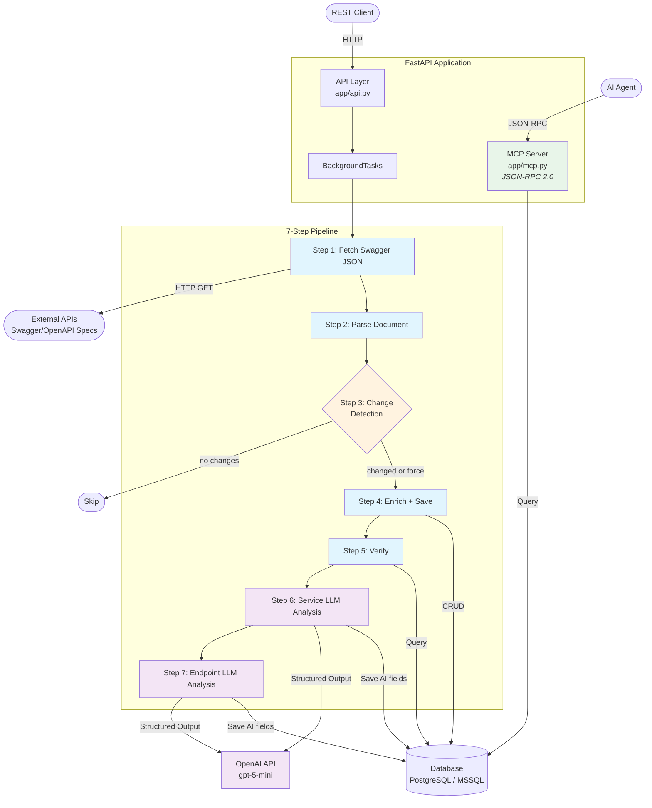
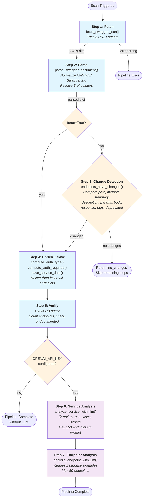
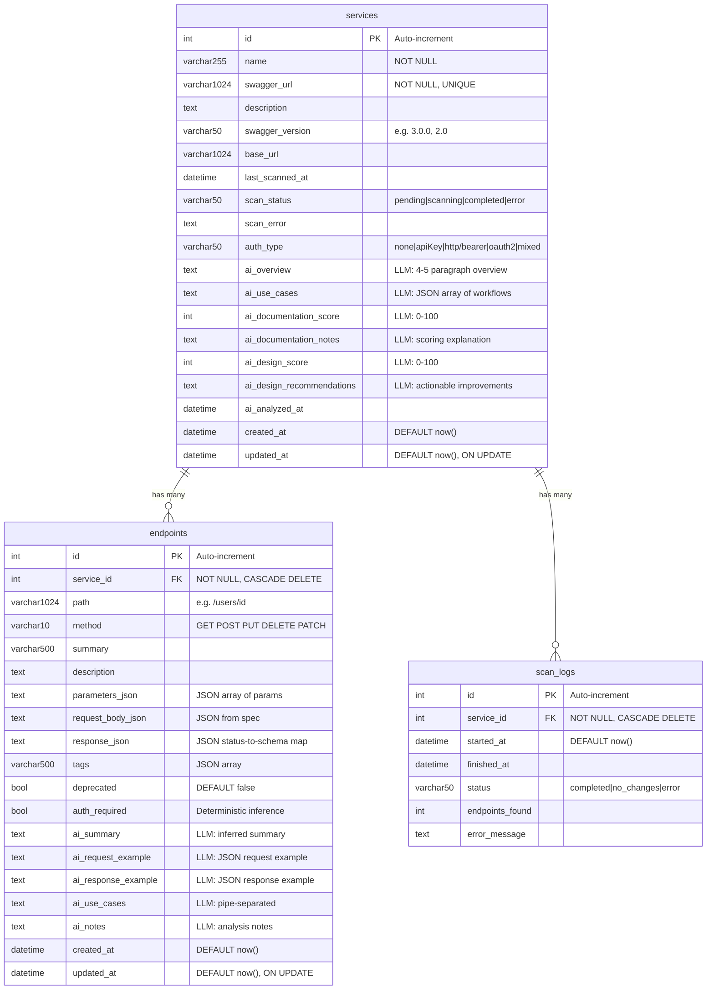

# SwaggerAgent

An AI-powered FastAPI service that fetches, parses, and stores OpenAPI/Swagger documentation from registered APIs, then enriches it with LLM-generated analysis — including business overviews, quality scores, design recommendations, and realistic request/response examples.

## Features

- **Automatic OpenAPI Discovery** — tries multiple URL variants (`/swagger.json`, `/openapi.json`, `/api-docs`, etc.) to locate the spec
- **OpenAPI 3.x & Swagger 2.0** — normalizes both formats into a unified structure with recursive `$ref` resolution
- **Change Detection** — compares parsed endpoints against the database; skips processing when nothing changed
- **Deterministic Auth Inference** — detects auth type from security schemes and per-endpoint auth requirements via heuristic rules
- **LLM-Powered Analysis** — generates service overviews, use-cases, documentation quality scores (0–100), API design scores, and per-endpoint request/response examples
- **Markdown Reports** — on-demand single-service or all-services reports with Table of Contents
- **Background Scanning** — non-blocking scans via FastAPI `BackgroundTasks`
- **MCP Server** — Model Context Protocol (JSON-RPC 2.0) endpoint exposing `GetServices` and `GetServiceDetails` tools for AI agent integrations
- **PostgreSQL / MSSQL Storage** — persistent storage with Alembic migrations and cascade deletes (PostgreSQL default, MSSQL optional via `DB_TYPE`)

---

## Table of Contents

- [Architecture Overview](#architecture-overview)
- [High-Level Architecture Diagram](#high-level-architecture-diagram)
- [7-Step Pipeline](#7-step-pipeline)
- [Database Schema](#database-schema)
- [API Reference](#api-reference)
- [LLM Usage Details](#llm-usage-details)
- [Key Modules](#key-modules)
- [Configuration & Environment Variables](#configuration--environment-variables)
- [Getting Started](#getting-started)
- [Testing](#testing)
- [Logging](#logging)
- [Project Structure](#project-structure)

---

## Architecture Overview

SwaggerAgent follows a pipeline architecture: services are registered via REST API, scans are triggered manually (or in bulk), and a 7-step pipeline fetches, parses, saves, and analyzes each service's OpenAPI specification.

### High-Level Architecture Diagram



### Module Responsibility

| Module | Role |
|--------|------|
| `app/main.py` | FastAPI app factory, lifespan events, logging configuration |
| `app/api.py` | 15 REST endpoints + `/health`; background scan triggers |
| `app/agent.py` | Pipeline runner — orchestrates the 7-step workflow |
| `app/tools.py` | 6 tool functions: fetch, parse, save, analyze_service, analyze_endpoint, get_service_info |
| `app/analysis.py` | Deterministic auth inference: `compute_auth_type()`, `compute_auth_required()` |
| `app/crud.py` | All database operations; `replace_endpoints()` does delete-then-insert |
| `app/models.py` | SQLAlchemy ORM: `Service`, `Endpoint`, `ScanLog` |
| `app/schemas.py` | Pydantic request/response schemas with `from_attributes=True` |
| `app/config.py` | Pydantic-Settings; builds database connection string (PostgreSQL or MSSQL) |
| `app/database.py` | SQLAlchemy engine, `SessionLocal`, `Base`, `get_db` dependency |
| `app/markdown.py` | Markdown report generation (single service and all-services with TOC) |
| `app/mcp.py` | MCP (Model Context Protocol) JSON-RPC 2.0 server — `GetServices` and `GetServiceDetails` tools |

---

## 7-Step Pipeline

The pipeline is orchestrated by `run_swagger_analysis()` in `app/agent.py`. Steps 1–5 are pure Python; steps 6–7 invoke the OpenAI API.



### Step Details

| Step | Function | LLM | Description |
|------|----------|-----|-------------|
| 1 | `fetch_swagger_json()` | No | Tries URL variants: base, `/swagger.json`, `/v1/swagger.json`, `/openapi.json`, `/api-docs`, `/docs`. Validates response contains `swagger`, `openapi`, or `paths` keys. |
| 2 | `parse_swagger_document()` | No | Detects spec version, resolves `$ref` pointers recursively (depth 10, circular detection), extracts endpoints with parameters, request bodies, responses, and security schemes. |
| 3 | `endpoints_have_changed()` | No | Compares fingerprints of path, method, summary, description, parameters, request_body, response, tags, deprecated. Returns early with `"no_changes"` if identical. **Skipped when `force=True`.** |
| 4 | `save_service_data()` | No | Enriches endpoints with `compute_auth_type()` and `compute_auth_required()`. Updates service metadata. Calls `replace_endpoints()` (delete-then-insert). |
| 5 | Direct DB query | No | Counts persisted endpoints, checks for undocumented ones. |
| 6 | `analyze_service_with_llm()` | **Yes** | Generates overview, use-cases, documentation quality score (0–100), design score (0–100), design recommendations, and per-endpoint summaries. Caps endpoint list at **150**. |
| 7 | `analyze_endpoint_with_llm()` | **Yes** | Generates realistic request/response examples for endpoints missing them. Caps at **50 endpoints** to control LLM costs. |

---

## Database Schema

Three tables with cascade-delete relationships: deleting a Service removes all its Endpoints and ScanLogs.



### Indexes

| Index | Table | Column(s) | Type |
|-------|-------|-----------|------|
| `uq_services_swagger_url` | `services` | `swagger_url` | Unique |
| `ix_endpoints_service_id` | `endpoints` | `service_id` | Index |
| `ix_scan_logs_service_id` | `scan_logs` | `service_id` | Index |

### Relationships

- **Service → Endpoint**: One-to-many with `cascade="all, delete-orphan"`. Deleting a service removes all its endpoints.
- **Service → ScanLog**: One-to-many with `cascade="all, delete-orphan"`. Deleting a service removes all its scan logs.
- **replace_endpoints()**: Uses delete-then-insert strategy — all existing endpoints for a service are removed and re-inserted on each scan.

---

## API Reference

### Service Management

| Method | Path | Status | Response | Purpose |
|--------|------|--------|----------|---------|
| `POST` | `/services` | 201 | `ServiceResponse` | Register a new service (409 if URL already exists) |
| `GET` | `/services` | 200 | `ServiceListResponse[]` | List all services with endpoint counts |
| `GET` | `/services/{service_id}` | 200 | `ServiceResponse` | Get service details with all endpoints |
| `PUT` | `/services/{service_id}` | 200 | `ServiceResponse` | Update service name and/or URL |
| `DELETE` | `/services/{service_id}` | 200 | `{"message": "..."}` | Delete service (cascades to endpoints + scan logs) |

### Scanning & Analysis

| Method | Path | Status | Response | Purpose |
|--------|------|--------|----------|---------|
| `POST` | `/services/{service_id}/scan` | 202 | `ScanTriggerResponse` | Trigger scan with change detection |
| `POST` | `/services/{service_id}/scan/force` | 202 | `ScanTriggerResponse` | Force full scan (bypass change detection) |
| `POST` | `/services/by-name/{service_name}/scan` | 202 | `ScanByNameResponse` | Scan all services matching name (case-insensitive) |
| `POST` | `/services/scan` | 202 | `ScanAllResponse` | Scan all registered services |
| `POST` | `/services/scan/force` | 202 | `ScanAllResponse` | Force scan all services |
| `GET` | `/services/{service_id}/scan-status` | 200 | `ScanStatusResponse` | Get scan status, last scanned time, errors |
| `POST` | `/services/{service_id}/analyze` | 202 | `{"message", "service_id"}` | Re-run LLM analysis only (no re-fetch) |

### Results & Reporting

| Method | Path | Status | Response | Purpose |
|--------|------|--------|----------|---------|
| `GET` | `/services/{service_id}/analysis` | 200 | JSON | Service-level AI fields + per-endpoint AI analysis |
| `GET` | `/services/{service_id}/markdown` | 200 | `text/markdown` | Formatted Markdown report for a single service |
| `GET` | `/services/markdown/all` | 200 | `text/markdown` | Combined Markdown report for all services with TOC |

### Health

| Method | Path | Status | Response | Purpose |
|--------|------|--------|----------|---------|
| `GET` | `/health` | 200 | `{"status": "ok", "service": "SwaggerAgent"}` | Health check |

### MCP (Model Context Protocol)

| Method | Path | Status | Response | Purpose |
|--------|------|--------|----------|---------|
| `POST` | `/mcp` | 200/202 | JSON-RPC 2.0 | MCP tool-call endpoint for AI agent integrations |

The MCP endpoint implements JSON-RPC 2.0 and exposes two tools:

| Tool | Input | Description |
|------|-------|-------------|
| `GetServices` | _(none)_ | List all registered services with names and AI overview descriptions |
| `GetServiceDetails` | `service_name` (string) | Full Markdown documentation for a named service (case-insensitive match) |

Supported JSON-RPC methods: `initialize`, `ping`, `tools/list`, `tools/call`.

### Key Schemas

**ServiceCreate** (POST `/services` body):
```
name: str            — Display name for the service
swagger_url: str     — URL to the Swagger/OpenAPI spec
```

**ServiceResponse** (returned by most service endpoints):
```
id, name, swagger_url, description, swagger_version, base_url,
last_scanned_at, scan_status, scan_error,
auth_type,
ai_overview, ai_use_cases, ai_documentation_score, ai_documentation_notes,
ai_design_score, ai_design_recommendations, ai_analyzed_at,
endpoints: EndpointResponse[]
```

**EndpointResponse** (nested in ServiceResponse):
```
id, path, method, summary, description,
parameters_json, request_body_json, response_json, tags, deprecated,
auth_required,
ai_summary, ai_use_cases, ai_notes, ai_request_example, ai_response_example
```

**ScanStatusResponse** (GET `/services/{id}/scan-status`):
```
service_id, scan_status, last_scanned_at, scan_error
```

---

## LLM Usage Details

LLM analysis runs only in pipeline steps 6 and 7, and only when `OPENAI_API_KEY` is configured. If the key is empty, pipeline completes successfully after step 5 without AI enrichment.

### Configuration

| Variable | Default | Purpose |
|----------|---------|---------|
| `OPENAI_API_KEY` | `""` (disabled) | OpenAI API key; empty = skip LLM steps |
| `LLM_ANALYSIS_MODEL` | `gpt-5-mini` | Model used for steps 6 and 7 |
| `LLM_ANALYSIS_TEMPERATURE` | `0.2` | Slightly creative for realistic examples |

### Step 6: Service-Level Analysis (`analyze_service_with_llm`)

- **Model**: `gpt-5-mini` at temperature `0.2`
- **Input**: Service metadata + endpoint list (capped at **150 endpoints** to fit the token budget)
- **Method**: LangChain `model.with_structured_output(ServiceAnalysisOutput)`
- **Output fields**:

| Field | Type | Description |
|-------|------|-------------|
| `ai_overview` | text | 4–5 paragraph business domain description |
| `ai_use_cases` | JSON array | 4–10 concrete business workflows |
| `ai_documentation_score` | int (0–100) | Documentation completeness rating |
| `ai_documentation_notes` | text | Scoring explanation with specific gaps |
| `ai_design_score` | int (0–100) | REST API design quality rating |
| `ai_design_recommendations` | text | 4–6 actionable improvements with examples |
| Per-endpoint `ai_summary` | text | 1–2 sentence summary |
| Per-endpoint `ai_use_cases` | text | Pipe-separated use cases |
| Per-endpoint `ai_notes` | text | Additional analysis notes |

**Scoring rubric** (embedded in prompt):
- 90–100: Comprehensive with examples
- 70–89: Good coverage, minor gaps
- 50–69: Moderate, missing details
- 30–49: Sparse documentation
- 0–29: Minimal or absent

### Step 7: Per-Endpoint Deep Analysis (`analyze_endpoint_with_llm`)

- **Model**: `gpt-5-mini` at temperature `0.2`
- **Input**: Endpoint metadata (parameters, request body schema, response schema)
- **Scope**: Only endpoints **missing** `ai_request_example` or `ai_response_example`; capped at **50 endpoints** (`MAX_DEEP = 50`)
- **Method**: LangChain `model.with_structured_output(EndpointAnalysisOutput)`
- **Output fields**:

| Field | Type | Description |
|-------|------|-------------|
| `ai_summary` | text | 1–2 sentences, max 120 chars (only if spec summary missing) |
| `ai_request_example` | JSON string | Realistic request body with real names, emails, IDs |
| `ai_response_example` | JSON string | Realistic 200/201 response body |

### Error Handling

- All LLM exceptions are caught, logged, and returned as error description strings
- LLM failures do **not** block the pipeline — the fetch/parse/save steps have already completed
- Individual endpoint analysis failures don't stop processing of remaining endpoints

---

## Key Modules

### `app/analysis.py` — Deterministic Auth Inference

Two pure functions that require no LLM:

**`compute_auth_type(security_schemes: dict) -> str`**

Maps OpenAPI security scheme definitions to canonical types:

| Scheme | Returns |
|--------|---------|
| `apiKey` | `"apiKey"` |
| `http` + bearer | `"http/bearer"` |
| `http` + basic | `"http/basic"` |
| `oauth2` | `"oauth2"` |
| `openIdConnect` | `"openIdConnect"` |
| Multiple types | `"mixed"` |
| No schemes | `"none"` |

**`compute_auth_required(security_json, path, method, parameters_json) -> bool | None`**

Applies rules in priority order:

| Priority | Rule | Result |
|----------|------|--------|
| 1 | Explicit `security` array (non-empty) | `True` |
| 2 | Explicit `security: []` (empty) | `False` |
| 3 | Auth-named parameters (`authorization`, `api_key`, `x-api-key`, `token`) | `True` |
| 4 | Public paths (`/health`, `/status`, `/version`, `/ping`, `/swagger`, `/docs`, `/metrics`) | `False` |
| 5 | Login paths (`/login`, `/signin`, `/token`, `/oauth/token`) | `False` |
| 6 | Logout paths (`/logout`, `/signout`) | `True` |
| 7 | Private paths (`/admin`, `/private`, `/me`, `/account`, `/profile`, `/settings`) | `True` |
| 8 | Mutating methods (POST, PUT, PATCH, DELETE) | `True` |
| 9 | Path with parameters (e.g. `/orders/{id}`) | `True` |
| 10 | None of the above | `None` (unknown) |

### `app/tools.py` — 6 Tool Functions

| Function | Purpose |
|----------|---------|
| `fetch_swagger_json(url)` | Fetches OpenAPI spec from multiple URL variants |
| `parse_swagger_document(data, url)` | Normalizes OAS 3.x / Swagger 2.0 into unified structure |
| `save_service_data(service_id, parsed_data)` | Persists enriched service + endpoints to DB |
| `analyze_service_with_llm(service_id, parsed_data)` | LLM service-level analysis |
| `analyze_endpoint_with_llm(service_id, path, method)` | LLM per-endpoint deep analysis |
| `get_service_info(service_id)` | Retrieves service info from DB |

### `app/markdown.py` — Report Generation

- **`service_to_markdown(service)`**: Single-service report with sections for metadata, AI analysis (overview, quality/design score bars, auth type, workflows), and endpoints grouped by tag (parameters table, request/response JSON blocks, auth badge, AI analysis)
- **`all_services_to_markdown(services)`**: Combined report for all services with Table of Contents (anchor links)
- Helper functions: `_make_anchor()`, `_parse_json_field()`, `_format_json_block()`, `_filter_json_content_types()`, `_endpoint_to_markdown()`

### `app/crud.py` — Database Operations

Key patterns:
- **`replace_endpoints()`**: Delete-then-insert — removes all existing endpoints for a service, then bulk inserts the new set. This simplifies diffing and ensures a clean state.
- **`endpoints_have_changed()`**: Compares fingerprint sets of (path, method, summary, description, parameters_json, request_body_json, response_json, tags, deprecated). Returns `True` if any difference exists.
- **`update_service_ai()` / `update_endpoint_ai()`**: Separate methods for AI fields; only update non-None values.
- All CRUD functions return `None` (not exceptions) for missing records.

---

## Configuration & Environment Variables

Copy `.env.example` to `.env` and fill in your values:

```bash
cp .env.example .env
```

| Variable | Default | Purpose |
|----------|---------|---------|
| `DB_TYPE` | `postgres` | Database backend: `postgres` or `sqlserver` |
| `DB_HOST` | `localhost` | Database server hostname |
| `DB_PORT` | `5432` | Database server port (5432 for PostgreSQL, 1433 for MSSQL) |
| `DB_NAME` | `swagger_agent` | Database name |
| `DB_USER` | `postgres` | Database user |
| `DB_PASSWORD` | `postgres` | Database password |
| `OPENAI_API_KEY` | `""` (disabled) | OpenAI API key; empty = skip LLM analysis |
| `LLM_MODEL` | `gpt-5-mini` | Reserved for future pipeline steps |
| `LLM_TEMPERATURE` | `0.0` | Reserved for future pipeline steps |
| `LLM_ANALYSIS_MODEL` | `gpt-5-mini` | Model for LLM analysis (steps 6–7) |
| `LLM_ANALYSIS_TEMPERATURE` | `0.2` | Temperature for LLM analysis |
| `APP_HOST` | `0.0.0.0` | Application bind address |
| `APP_PORT` | `8000` | Application port |

### Database Connection String

Built automatically by `app/config.py` based on `DB_TYPE`:

**PostgreSQL** (default):
```
postgresql+psycopg2://{DB_USER}:{DB_PASSWORD}@{DB_HOST}:{DB_PORT}/{DB_NAME}
```

**MSSQL** (`DB_TYPE=sqlserver`):
```
mssql+pyodbc://{DB_USER}:{DB_PASSWORD}@{DB_HOST}:{DB_PORT}/{DB_NAME}
  ?driver=ODBC+Driver+18+for+SQL+Server&TrustServerCertificate=yes
```

---

## Getting Started

### Prerequisites

- **Python 3.12+**
- **Docker & Docker Compose** (for PostgreSQL server)
- **OpenAI API key** (optional — LLM analysis is skipped without it)
- **ODBC Driver 18 for SQL Server** (only if using `DB_TYPE=sqlserver`)

### Option 1: Docker Compose (Production)

Starts both PostgreSQL and the application:

```bash
# Copy and configure environment
cp .env.example .env
# Edit .env with your OPENAI_API_KEY

# Build and start
docker-compose up --build
```

The Dockerfile entrypoint automatically:
1. Waits for the database to be ready (`wait_for_db.py`)
2. Runs Alembic migrations (`alembic upgrade head`)
3. Starts Uvicorn on port `8000`

The API is available at `http://localhost:8000`. Health check: `GET http://localhost:8000/health`.

### Option 2: Local Development (PostgreSQL in Docker)

Run PostgreSQL in Docker, application locally with hot-reload:

```bash
# Start PostgreSQL only
docker-compose up -d postgres

# Wait for database to be ready and create it if missing
DB_TYPE=postgres DB_HOST=127.0.0.1 DB_PORT=5432 DB_USER=swagger_agent DB_PASSWORD='YourStrong!Passw0rd' python wait_for_db.py

# Run Alembic migrations
DB_TYPE=postgres DB_HOST=127.0.0.1 DB_PORT=5432 DB_USER=swagger_agent DB_PASSWORD='YourStrong!Passw0rd' alembic upgrade head

# Start the app with live reload
DB_TYPE=postgres DB_HOST=127.0.0.1 DB_PORT=5432 DB_USER=swagger_agent DB_PASSWORD='YourStrong!Passw0rd' uvicorn app.main:app --reload
```

### Option 3: Debug Mode (Docker + debugpy)

For remote debugging with VS Code:

```bash
docker-compose -f docker-compose.yml -f docker-compose.debug.yml up --build
```

This:
- Mounts the project directory as a volume (live code changes)
- Exposes **debugpy on port 5678**
- Waits for a debugger to connect before starting

Attach VS Code using a "Python: Remote Attach" launch configuration targeting `localhost:5678`.

### Quick Verification

```bash
# Health check
curl http://localhost:8000/health
# → {"status":"ok","service":"SwaggerAgent"}

# Register a service
curl -X POST http://localhost:8000/services \
  -H "Content-Type: application/json" \
  -d '{"name": "Petstore", "swagger_url": "https://petstore.swagger.io/v2/swagger.json"}'

# Trigger a scan
curl -X POST http://localhost:8000/services/1/scan

# Check scan status
curl http://localhost:8000/services/1/scan-status

# Get full details
curl http://localhost:8000/services/1

# Get Markdown report
curl http://localhost:8000/services/1/markdown
```

---

## Testing

### Strategy

- **Unit tests**: Use an **in-memory SQLite** database (no PostgreSQL required). The `tests/conftest.py` does three critical things at import time:
  1. **Stubs `pyodbc`** before SQLAlchemy imports it (pyodbc is only needed for `DB_TYPE=sqlserver`)
  2. **Creates a `StaticPool` SQLite engine** so tables persist within a test session
  3. **Overrides FastAPI's `get_db` dependency** to use the test session
- **Integration tests**: Require a live PostgreSQL instance (Docker). Marked with `@pytest.mark.integration`.
- **LLM integration tests**: Make real OpenAI API calls. Marked with `@pytest.mark.llm_integration`. Skipped if `OPENAI_API_KEY` is not set.

### Key Fixtures (`tests/conftest.py`)

| Fixture | Scope | Purpose |
|---------|-------|---------|
| `db_engine` | function | Fresh SQLite engine with table creation/teardown |
| `db_session` | function | Transaction-scoped session, rolled back after each test |
| `client` | function | FastAPI `TestClient` with DB dependency override |
| `mock_agent` | function | Patches background scan function to prevent execution |

### Commands

```bash
# Run all unit tests (no PostgreSQL required)
pytest -k "not integration" -v

# Run all tests (requires PostgreSQL Docker)
pytest -v

# Run a single test file
pytest tests/test_tools.py

# Run a specific test
pytest tests/test_tools.py::test_fetch_swagger_json_success

# Run with coverage report
pytest --cov=app --cov-report=term-missing

# Run integration tests only (requires PostgreSQL Docker)
pytest tests/test_integration.py -v

# Run LLM integration tests (requires OPENAI_API_KEY)
pytest tests/test_llm_integration.py -v
```

### Test Coverage

| Test File | Focus | Tests |
|-----------|-------|-------|
| `tests/test_tools.py` | Fetch, parse, save, analysis tool logic | 50+ |
| `tests/test_api.py` | REST endpoints, background tasks, status tracking | 62+ |
| `tests/test_crud.py` | Database CRUD operations, cascading deletes | 31+ |
| `tests/test_analysis.py` | Auth type/required inference heuristics | 29 |
| `tests/test_markdown.py` | Markdown generation and formatting | 28+ |
| `tests/test_agent.py` | Pipeline execution, change detection, force flag | 11 |
| `tests/test_mcp.py` | MCP JSON-RPC endpoint and tool calls | varies |
| `tests/test_integration.py` | Full workflow with real PostgreSQL | varies |
| `tests/test_llm_integration.py` | Real OpenAI API calls | varies |

### Pytest Markers

Defined in `pyproject.toml`:

| Marker | Purpose | Skip with |
|--------|---------|-----------|
| `integration` | Tests requiring PostgreSQL Docker | `-k "not integration"` |
| `llm_integration` | Tests making real OpenAI API calls | `-k "not llm_integration"` |

---

## Logging

All modules use `logging.getLogger(__name__)`. The root handler is configured in `app/main.py`:

- **Format**: `%(asctime)s [%(levelname)s] %(name)s: %(message)s`
- **Level**: `INFO`
- **Outputs**:
  - `stdout` (StreamHandler)
  - `logs/swagger_agent.log` (FileHandler)

Example log lines:

```
2026-04-13 10:23:45,123 [INFO] app.api: Scan started for service_id=1
2026-04-13 10:24:12,456 [INFO] app.agent: Step 1 complete: fetched 45 endpoints
2026-04-13 10:24:15,789 [ERROR] app.tools: LLM analysis failed: rate limit exceeded
```

Key log sources:

| Logger | Events |
|--------|--------|
| `app.api` | Background scan lifecycle, request handling |
| `app.agent` | Pipeline step progress, change detection results |
| `app.tools` | Fetch/parse success, LLM calls and errors |
| `app.main` | Application startup and shutdown |

---

## Project Structure

```
SwaggerAgent/
├── app/
│   ├── __init__.py
│   ├── main.py            # FastAPI app, lifespan, logging setup
│   ├── api.py             # REST endpoints, background scan triggers
│   ├── agent.py           # 7-step pipeline orchestrator
│   ├── tools.py           # Fetch, parse, save, LLM analysis functions
│   ├── analysis.py        # Deterministic auth inference (no LLM)
│   ├── crud.py            # All database CRUD operations
│   ├── models.py          # SQLAlchemy ORM models (Service, Endpoint, ScanLog)
│   ├── schemas.py         # Pydantic request/response schemas
│   ├── config.py          # Pydantic-Settings, database connection string
│   ├── database.py        # SQLAlchemy engine, SessionLocal, get_db
│   ├── markdown.py        # Markdown report generation
│   └── mcp.py             # MCP (Model Context Protocol) JSON-RPC 2.0 server
├── alembic/
│   ├── env.py             # Alembic migration environment
│   └── versions/
│       └── 001_initial_schema.py  # Create services, endpoints, scan_logs tables
├── tests/
│   ├── conftest.py        # Test fixtures: SQLite engine, pyodbc stub, TestClient
│   ├── test_tools.py      # Tool function tests
│   ├── test_api.py        # API endpoint tests
│   ├── test_crud.py       # Database operation tests
│   ├── test_analysis.py   # Auth inference tests
│   ├── test_markdown.py   # Markdown generation tests
│   ├── test_agent.py      # Pipeline execution tests
│   ├── test_mcp.py        # MCP JSON-RPC endpoint tests
│   ├── test_integration.py    # Full PostgreSQL integration tests
│   └── test_llm_integration.py # Real OpenAI API tests
├── logs/                  # Application log files (auto-created)
├── Dockerfile             # Python 3.12-slim + ODBC Driver 18
├── docker-compose.yml     # Production: PostgreSQL 18 + app
├── docker-compose.debug.yml  # Debug overlay: debugpy + volume mount
├── debug_main.py          # Entrypoint for debug mode
├── wait_for_db.py         # Waits for database, creates DB if missing
├── wait_for_debug.py      # Waits for debugpy to be ready
├── alembic.ini            # Alembic configuration
├── pyproject.toml         # Pytest config, coverage settings
├── requirements.txt       # Python dependencies
└── .env.example           # Environment variable template
```
